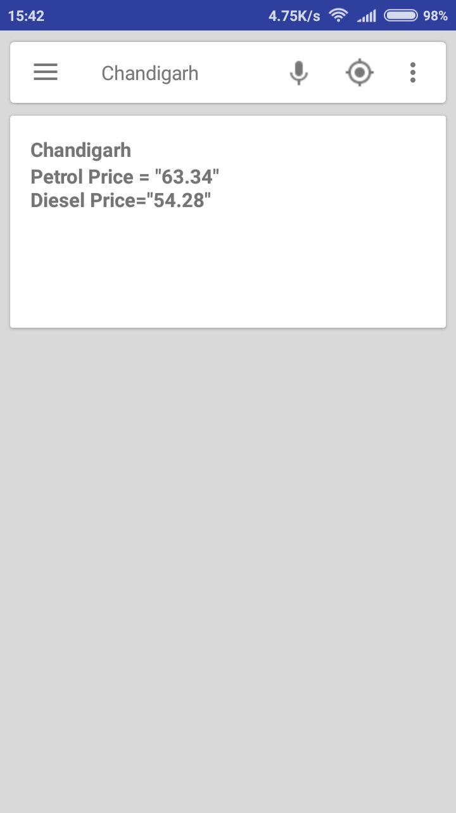

# FuelFriend

Get updated Fuel(Petrol and Diesel) price on your android phone (India only)

## Task List For Maintainers And Contributors.
- [x] Implement a town search bar.
- [ ] Save data(statename, stateecode, towname, last 7days Petrol and Diesel price ) in sqlite database.

StateTable

| field        | Type           | Key  |  
| ------------- |-------------| -----|
| _id      | INTEGER | PRIMARY |
| state_code|TEXT NOT NULL      |  |
| state_name | TEXT  NOT NULL  |   |    |

TownTable

| field        | Type           | Key  |  
| ------------- |-------------| -----|
| _id      | INTEGER | PRIMARY |
| town_code|TEXT NOT NULL      |  |
| town_name | TEXT  NOT NULL  |   |
| lat       | TEXT NOT NULL | |
|lon | TEXT NOT NULL |   |
| is_metro | TEXT NOT NULL   ("N" if false else "Y") |    |
| state_id | TEXT | FOREIGN KEY   references StateTable(state_code) |

HpclDieselPriceTable & HpclPetrolPriceTable

| field        | Type           | Key  |  
| ------------- |-------------| -----|
| _id      | INTEGER | PRIMARY |
| town_id |TEXT      |FOREIGN KEY   references TownTable(town_code)  |
| price_on_mon | TEXT  |   |
| price_on_tues       | TEXT | |
| price_on_wed| TEXT |   |
| price_on_thr | TEXT |  |
| price_on_fri| TEXT |   |
|price_on_sat | TEXT |   |
| price_on_sun | TEXT |  |

- [ ] Query hpcl site once in a day and save result back in database - this has to be done for every single state to improve the user experience.
- [ ] Include data from [iocl site](https://iocl.com) too. Current data is taken only from [hpcl](http://hproroute.hpcl.co.in) site. Iocl site offers data of less number of towns (only main ones) as compared to hpcl site.  
- [ ] Ask users to choose their current town.
- [ ] App settings (change the current location)
- [ ] Create Main UI (includes current sarchbar, view to display current price of user's location and a line chart:displays last 7 days price)
- [ ] Make a release on PlayStore and F-Droid.
- [ ] Create a clock-like widget which will display current town and updated fuel price along with Clock.
- [ ] Include weather update in the widget.

## Install
Coming soon on Google Play Store

## Contributing

Please read [CONTRIBUTING.md](https://github.com/andy1729/FuelFriend/blob/master/CONTRIBUTING.md) for details on code of conduct, and the process for submitting pull requests.

## Author

* **Ujjawal Anand** - [*andy1729*](https://andy1729.github.io)

## License

This project is licensed under the MIT License - see the [LICENSE.md](LICENSE.md) file for details

## Acknowledgments

#### Open Source Libraries Used
Third party libraries used in this project
  * [okhttp](https://github.com/square/okhttp) - to fetch data from [hpcl website](http://hproroute.hpcl.co.in)
  * [FloatingSearchView](https://github.com/arimorty/floatingsearchview) to display a search box for searching towns.
  * [Gson](https://github.com/google/gson) to convert json objects into java objects
